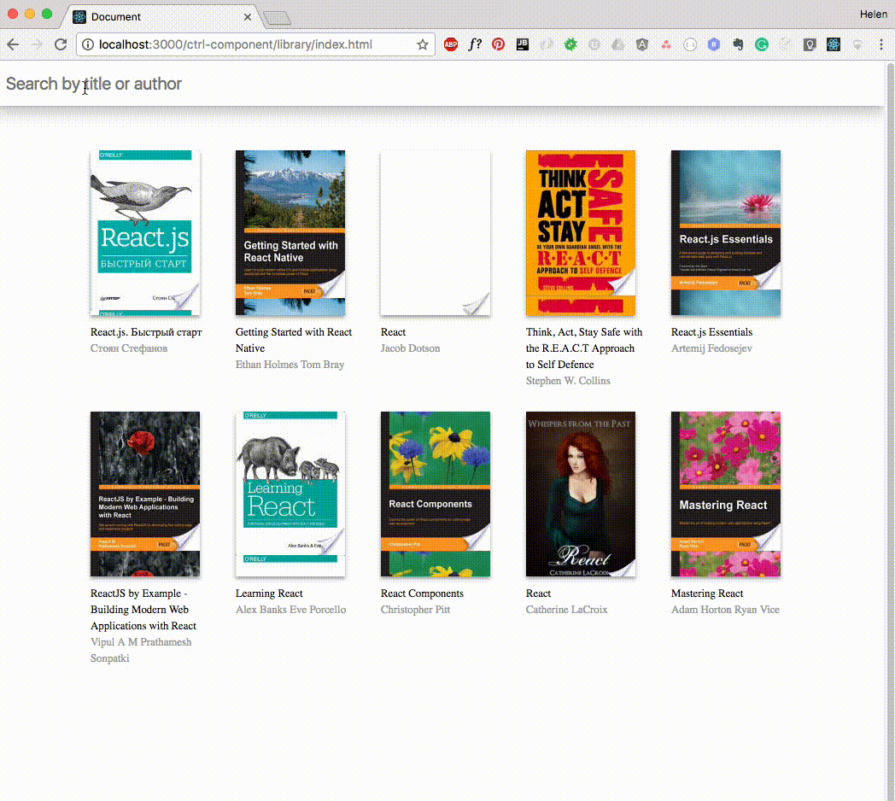

Библиотека
===

Ваша задача - реализовать компонент для отображиения и фильтра книжек в вашей библиотеке.



## Описание компонента

- Используйте `BookApi`, чтобы загрузить все доступные книжки:

У вас есть класс `BookApi` и метод `query`, который принимает строку как обязательный параметр, например:

```
BookApi.query("react").then(books => {
//You have an array of books here
})
```

- Реализуйте возможность пользователю увидеть все книги, доступные в приложении.

- Реализуйте возможность пользователю ввести в поле фильтр книг по названию и/или автору и увидеть книги, которые подходят под фильтр.


## Реализация

Необходимо завершить реализацию компонета `App`.

### Локально с использованием git

Компонент необходимо реализовать в файле `./js/App.js`. Файл уже подключен к документу, поэтому другие файлы изменять не требуется.
**Вы можете создавать любые дополнительные компоненты.**

### В песочнице CodePen

Реализуйте компонент во вкладке JS(Babel). Перед началом работы сделайте форк этого пена:

