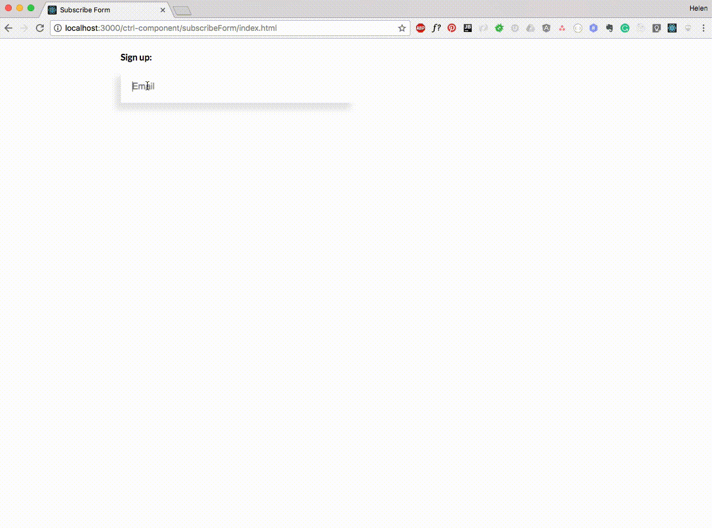

Форма подписки
===

Ваша задача - реализовать форму для подписки на новости.

## Описание компонента

## Реализация

Необходимо реализовать компонет `SubscribeForm`.

### Локально с использованием git

Компонент необходимо реализовать в файле `./js/SubscribeForm.js`. Файл уже подключен к документу, поэтому другие файлы изменять не требуется.
**Вы можете создавать любые дополнительные компоненты.**

### В песочнице CodePen

Реализуйте компонент во вкладке JS(Babel). Перед началом работы сделайте форк этого пена:

https://codepen.io/hoodsey20/pen/MEydyx