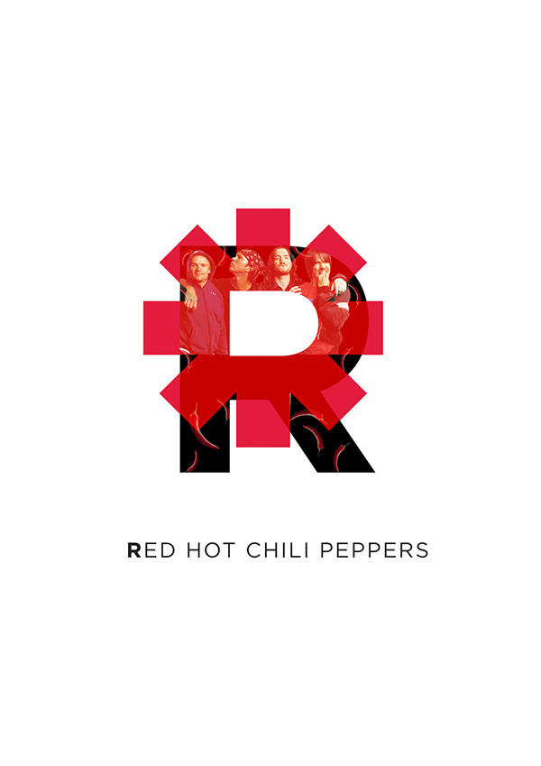
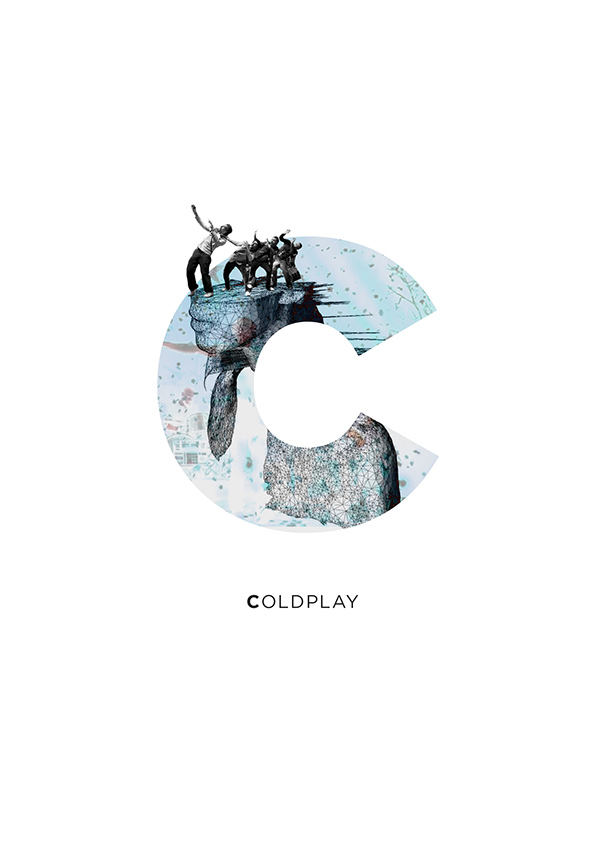
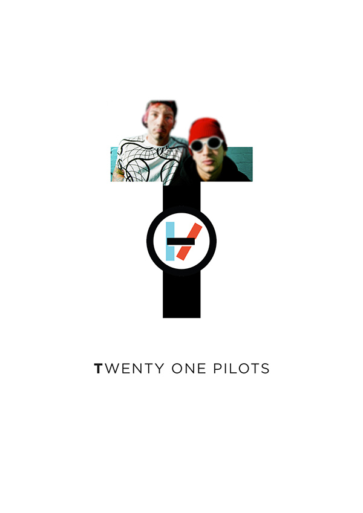

Конструктор футболки
===

Ваша задача - реализовать компонент-конструктор для создания надписи с использованием шрифта из изображений. Пользователь может выбрать шрифт из списка предложенных, затем написать текст (только латинские буквы) и увидеть его в виде изображений.


## Описание компонента

В проекте находится файл `App.js`, который содержит компонент класса `App`. `App` управляет состоянием приложения. В `state` компонента `App` имеются следующие свойства:
- массив `fonts` который мы получаем при вызове метода `getFonts` класса `AbcApi`;
- `selectedFont` со значением `null` по умолчанию, которое ожидает в качестве значения объект со свойствами выбранного шрифта из массива `fonts`;
- строка `text` – введенный пользователем текст, который должен отобразиться выбранным «картиночным» шрифтом.  

В файле `AbcApi.js` находится импровизированное API, при обращении к которому через метод `getFonts` мы получаем массив объектов. Каждый объект этого массива описывает отдельный шрифт и содержит два свойства:

1. строка `name` – название шрифта;
2. строка `path` – путь до папки с изображениями; в такой папке каждой букве латинского алфавита соответсвует одноимённое изображение с расширением `jpg`.

Пример содержимого массива:
```javascript
[
    {
        name: "abc1",
        path: "./images/abc1/images"
    },
    {
        name: "abc2",
        path: "./images/abc2/images"
    }
]
```

В файле `PictureFont.js` находится компонент `PictureFont`. В качестве параметров `PictureFont` принимает:
1. строку `text` – введенный пользователем текст, который нужно отобразить шрифтом-картинками;
2. строку `path` – путь к папке, где находятся картики букв.

`PictureFont` возвращает HTML-представление набранного текста выбранным «картиночным» шрифтом. Пример отображения текста «react»:
```html
<div class="PictureFont grid">
  <div class="char">
    
  </div>
  <div class="char">
    
  </div>
  <div class="char">
    
  </div>
  <div class="char">
    
  </div>
  <div class="char">
    
  </div>
</div>
```
Необходимо реализовать следующий функционал: 
- вывод для каждого из доступных «картиночных» шрифтов `input` типа `radio` с превью первых 3-х букв, пример HTML-кода для каждого шрифта:
  ```html
  <div class="grid center font-item">
    <input type="radio" name="font" value="abc1" id="abc1">
    <label for="abc1" class="grid-1">
      <div class="PictureFont grid">
        <div class="char">
          
        </div>
        <div class="char">
          
        </div>
        <div class="char">
          
        </div>
      </div>
    </label>
  </div>
  ```
- после выбора пользователем одного из шрифтов, появляется текстовое поле для ввода текста:
  ```html
  <div class="type-text">
    <textarea name="text" id="font-text" cols="30" rows="2" placeholder="Введите текст для футболки"></textarea>
  </div>
  ```
- при наборе текста в поле, текущий текст отображается выбранным «картиночным» шрифтом;
- после того как текст набран, пользователь может переключаться между шрифтами, при этом, в зависимости от выбранного им шрита, меняется и отображение набранного текста.

## Реализация

Необходимо реализовать два компонета:
1. `FontItem` – отвечает за вывод для каждого из доступных «картиночных» шрифтов с возможностью выбора пользователем. 
2. `TextRenderLine` – поле для ввода пользовательского текста, который будет отрисован выбранным «картиночным» шрифтом.

Оба файла уже созданы в папке `js`, подключены в `index.html` и вызваны в `App` в соответсвующих местах.

### Локально с использованием git

Компонент необходимо реализовать в файле `./js/App.js`. Файл уже подключен к документу, поэтому другие файлы изменять не требуется.
**Вы можете создавать любые дополнительные компоненты.**

### В песочнице CodePen

Реализуйте компонент во вкладке JS(Babel). Перед началом работы сделайте форк этого пена:

https://codepen.io/hoodsey20/pen/pWymMo
